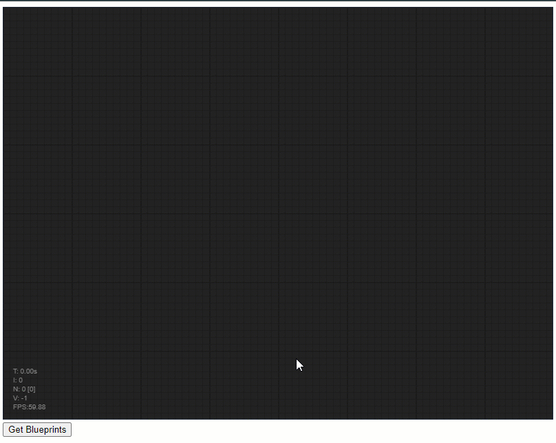

Work in progress.. Please try back later.

# mobject-graph-webserver

## Disclaimer

This is a personal guide not a peer reviewed journal or a sponsored publication. We make
no representations as to accuracy, completeness, correctness, suitability, or validity of any
information and will not be liable for any errors, omissions, or delays in this information or any
losses injuries, or damages arising from its display or use. All information is provided on an as
is basis. It is the reader’s responsibility to verify their own facts.

The views and opinions expressed in this guide are those of the authors and do not
necessarily reflect the official policy or position of any other agency, organization, employer or
company. Assumptions made in the analysis are not reflective of the position of any entity
other than the author(s) and, since we are critically thinking human beings, these views are
always subject to change, revision, and rethinking at any time. Please do not hold us to them
in perpetuity.

## Overview

mobject-graph is a library which allows realtime, deterministic TwinCAT programming using json (and any other format by using I_Serializer and I_Deserializer).

All nodes are "learnt" from the PLC project by clicking "Get Blueprints". At this point you can now draw and connect nodes. Changes are immediately transferred to the running PLC program and are executed. Results are sent back to the UI.

## Screenshot



## Getting started

### TwinCAT

To use this project you will need to run v0.1.1 of mobject-graph-test-project. Activate and run the TwinCAT project, then use mobject-graph-webserver to connect a graph flow based editor.

### Web Server

To clone

```
git clone --recurse-submodules https://github.com/Mobject-Dev-Team/mobject-graph-webserver.git
```

First install

```
npm install
```

Run

```
npm start
```
